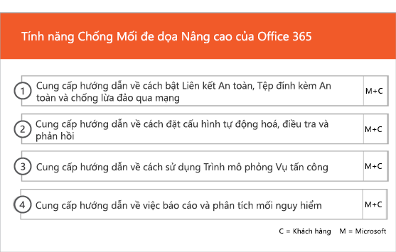
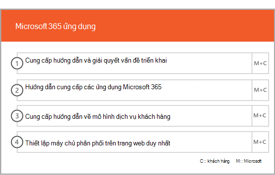

# Giai đoạn triển khai và di chuyển

Office 365 bộ nhớ ngoài có bốn giai đoạn chính — bắt đầu, đánh giá, remediate và Enable. Bạn có thể làm theo các giai đoạn này với một giai đoạn di chuyển dữ liệu tùy chọn như được hiển thị trong hình dưới đây.
  

  
> [!NOTE]
>Để biết thông tin về bộ nhớ ngoài và di chuyển cho Office 365 chính phủ Hoa Kỳ, xem [bộ nhớ ngoài và di chuyển cho Office 365 chính phủ Hoa Kỳ](US-Gov-appendix-onboarding-and-migration.md). 

Đối với các nhiệm vụ chi tiết cho từng giai đoạn, xem [FastTrack trách nhiệm](O365-fasttrack-responsibilities.md) và [trách nhiệm của bạn](O365-your-responsibilities.md).
  
## Bắt đầu giai đoạn

Sau khi bạn mua số lượng và loại giấy phép thích hợp, hãy làm theo hướng dẫn từ email xác nhận mua để liên kết giấy phép với đối tượng thuê hiện tại hoặc mới của bạn. 
  
Bạn có thể nhận trợ giúp thông qua [Trung tâm quản trị Microsoft 365](https://go.microsoft.com/fwlink/?linkid=2032704) hoặc [trang web FastTrack](https://go.microsoft.com/fwlink/?linkid=780698). 

Để được trợ giúp thông qua [Trung tâm quản trị Microsoft 365](https://go.microsoft.com/fwlink/?linkid=2032704), các dấu hiệu quản trị của bạn vào Trung tâm quản trị và sau đó nhấp vào **cần giúp đỡ?** widget. 

Để được trợ giúp thông qua [trang web FastTrack](https://go.microsoft.com/fwlink/?linkid=780698): 
1.    Đăng nhập vào [trang web FastTrack](https://go.microsoft.com/fwlink/?linkid=780698). 
2.    Chọn **yêu cầu hỗ trợ cho Microsoft 365** từ các **hành động nhanh** trên đầu trang đích của bạn hoặc bằng cách chọn **yêu cầu hỗ trợ cho Microsoft 365** trên thẻ triển khai.
3.    Hoàn thành **yêu cầu hỗ trợ cho Microsoft 365** mẫu. 
  
Đối tác cũng có thể nhận trợ giúp thông qua [trang web FastTrack](https://go.microsoft.com/fwlink/?linkid=780698) thay mặt cho khách hàng. Để làm như vậy:
1.    Đăng nhập vào [trang web FastTrack](https://go.microsoft.com/fwlink/?linkid=780698). 
2.    Chọn **khách hàng của tôi**.
3.    Tìm kiếm khách hàng của bạn hoặc chọn chúng từ danh sách khách hàng của bạn.
4.    Chọn **dịch vụ**.
5.    Hoàn thành **yêu cầu hỗ trợ cho Microsoft 365** mẫu.

Bạn cũng có thể yêu cầu FastTrack Trung tâm trợ giúp từ các [trang web fasttrack](https://go.microsoft.com/fwlink/?linkid=780698) trong danh sách các dịch vụ có sẵn cho người thuê nhà của bạn. 
    
Trong giai đoạn này, chúng tôi thảo luận về quá trình bộ nhớ ngoài, xác minh dữ liệu của bạn, và thiết lập một cuộc họp kickoff. Điều này bao gồm làm việc với bạn để hiểu cách bạn dự định sử dụng dịch vụ và mục tiêu của tổ chức của bạn và kế hoạch để thúc đẩy việc sử dụng dịch vụ.
  

  
## Đánh giá giai đoạn

FastTrack Manager của bạn tiến hành một cuộc gọi lập kế hoạch thành công tương tác với bạn và nhóm nhận con nuôi của bạn. Điều này giới thiệu bạn về các khả năng của các dịch vụ đủ điều kiện mà bạn đã mua, những nền tảng chính bạn cần để thành công, phương pháp để lái xe sử dụng dịch vụ và các kịch bản mà bạn có thể sử dụng để nhận giá trị từ các dịch vụ. Chúng tôi hỗ trợ bạn trong việc lập kế hoạch thành công và cung cấp phản hồi về các khu vực chính (nếu cần).
  
FastTrack chuyên gia làm việc với bạn để đánh giá môi trường nguồn của bạn và các yêu cầu. Chúng tôi cung cấp các công cụ để bạn thu thập dữ liệu về môi trường của bạn và hướng dẫn bạn thông qua ước tính băng thông yêu cầu và đánh máy trình duyệt Internet của bạn, Hệ điều hành khách hàng, Hệ thống tên miền (DNS), mạng, cơ sở hạ tầng, và hệ thống nhận dạng để xác định nếu có thay đổi được yêu cầu cho onboarding. 
  
Dựa trên thiết lập hiện tại của bạn, chúng tôi cung cấp một kế hoạch khắc phục mang lại môi trường nguồn của bạn đến các yêu cầu tối thiểu để thành công bộ nhớ ngoài cho Office 365 và, nếu cần thiết, cho hộp thư thành công và/hoặc di chuyển dữ liệu. Chúng tôi cung cấp một tập hợp các hoạt động đề xuất để tăng giá trị người dùng cuối và nhận con nuôi. Chúng tôi cũng thiết lập điểm kiểm tra thích hợp cho giai đoạn remediate.
  

  
## Giai đoạn remediate

Bạn thực hiện các tác vụ khắc phục dựa trên môi trường nguồn của bạn để bạn đáp ứng các yêu cầu về onboarding, áp dụng và di chuyển từng dịch vụ khi cần thiết.
  

  
Chúng tôi cũng cung cấp một tập hợp các hoạt động được đề xuất để tăng giá trị người dùng cuối và nhận con nuôi. Trước khi bắt đầu kích hoạt giai đoạn, chúng tôi cùng xác minh kết quả của các hoạt động khắc phục để đảm bảo rằng bạn đã sẵn sàng để tiến hành. 
  
Trong giai đoạn này, FastTrack quản lý của bạn làm việc với bạn về lập kế hoạch thành công, hướng dẫn bạn đến các nguồn lực phù hợp và thực tiễn tốt nhất để cung cấp hướng dẫn cho bạn để làm cho các dịch vụ có sẵn cho tổ chức của bạn và lái xe sử dụng trên các dịch vụ.
  
## Kích hoạt giai đoạn

Khi tất cả các hoạt động khắc phục hoàn tất, sự thay đổi tập trung để cấu hình cơ sở hạ tầng cốt lõi cho việc tiêu thụ dịch vụ, cung cấp văn phòng 365, và tiến hành các hoạt động để vận chuyển dịch vụ thông qua. 
  
## Lõi

Lõi bộ nhớ ngoài liên quan đến dịch vụ cung cấp và thuê và danh tính tích hợp. Nó cũng bao gồm các bước để cung cấp một nền tảng cho các dịch vụ bộ nhớ ngoài như Exchange Online, SharePoint Online và Skype for Business Online. Bạn và FastTrack Manager của bạn tiếp tục có cuộc họp lập kế hoạch thành công điểm kiểm tra để đánh giá tiến độ đối với mục tiêu của bạn và xác định những hỗ trợ thêm bạn cần.
  

  

  
> [!NOTE]
> WAP là viết tắt của proxy ứng dụng web. SSL là viết tắt của Secure Socket Layer. SDS là viết tắt của School Data Sync. Để biết thêm thông tin về SDS, xem [chào mừng bạn đến với Microsoft School Data Sync](https://go.microsoft.com/fwlink/?linkid=871480). 
  
Bộ nhớ ngoài cho một hoặc nhiều dịch vụ đủ điều kiện có thể bắt đầu một khi lõi bộ nhớ ngoài được hoàn tất.
  
## Trao đổi trực tuyến

Đối với Exchange Online, chúng tôi hướng dẫn bạn qua quá trình này để có được tổ chức của bạn đã sẵn sàng sử dụng email. Các bước chính xác, tùy thuộc vào môi trường nguồn và kế hoạch di chuyển email của bạn, có thể bao gồm cung cấp hướng dẫn cho:
- Thiết lập tính năng Exchange Online Protection (EOP) cho tất cả các miền hỗ trợ thư xác nhận trong Office 365.
    > [!NOTE]
    > Hồ sơ trao đổi thư (MX) của bạn phải trỏ tới Office 365. 
- Thiết lập Office 365 nâng cao mối đe dọa bảo vệ (ATP) tính năng nếu nó là một phần của dịch vụ đăng ký của bạn. Để biết thêm thông tin, xem [Office 365 nâng cao mối đe dọa bảo vệ](#office-365-advanced-threat-protection).
- Thiết lập tính năng ngăn mất dữ liệu (DLP) cho tất cả các miền hỗ trợ thư xác nhận trong Office 365 như một phần của dịch vụ đăng ký của bạn. Điều này được thực hiện khi bản ghi MX trỏ tới Office 365.
- Thiết lập Office 365 mã hóa thư (OME) cho tất cả các miền hỗ trợ thư xác nhận trong Office 365 là một phần của dịch vụ đăng ký của bạn. Điều này được thực hiện khi bản ghi MX trỏ tới Office 365.

> [!NOTE]
> Dịch vụ sao chép hộp thư (MRS) cố gắng di chuyển email quản lý quyền thông tin (IRM) từ hộp thư tại chỗ của bạn vào hộp thư Exchange Online tương ứng. Khả năng đọc sau khi di chuyển nội dung được bảo vệ phụ thuộc vào bản đồ khách hàng và sao chép các mẫu dịch vụ quản lý quyền Active Directory (AD RMS) cho dịch vụ quản lý quyền Azure (Azure RMS).

- Cấu hình cổng tường lửa.
- Thiết lập DNS, bao gồm yêu cầu tự động phát hiện, khung chính sách người gửi (SPF) và bản ghi MX (nếu cần). 
- Thiết lập luồng email giữa môi trường tin nhắn nguồn của bạn và Exchange Online (nếu cần).
- Cam kết di chuyển thư từ môi trường tin nhắn nguồn của bạn cho Office 365.
- Cấu hình máy khách hộp thư (Outlook dành cho Windows, Outlook trên web và Outlook dành cho iOS và Android).
    > [!NOTE]
    > Để biết thêm thông tin về di chuyển thư và dữ liệu, xem [di chuyển dữ liệu](O365-data-migration.md). 
  

  
## SharePoint trực tuyến và OneDrive dành cho doanh nghiệp

Đối với SharePoint Online và OneDrive for Business, chúng tôi cung cấp hướng dẫn cho:
- Thiết lập DNS.
- Cấu hình cổng tường lửa.
- Cung cấp người dùng và giấy phép.   
- Cấu hình SharePoint kết hợp tính năng, như tìm kiếm kết hợp, trang web kết hợp phân loại, loại nội dung, tạo trang web tự phục vụ kết hợp (SharePoint Server 2013 chỉ), mở rộng ứng dụng phóng, kết hợp OneDrive cho doanh nghiệp và extranet trang web.
    
FastTrack chuyên gia cung cấp hướng dẫn về di chuyển dữ liệu đến văn phòng 365 bằng cách sử dụng một sự kết hợp của các công cụ và tài liệu và thực hiện nhiệm vụ cấu hình khi áp dụng và khả thi.
  

  
## OneDrive cho doanh nghiệp

OneDrive cho doanh nghiệp, các bước phụ thuộc vào nếu bạn đang sử dụng SharePoint, và nếu có, phiên bản nào. 
  

  
## Văn phòng 365 nâng cao mối đe dọa bảo vệ

Đối với Office 365 ATP, chúng tôi cung cấp hướng dẫn cho:
- Cho phép liên kết an toàn, tệp đính kèm an toàn và chống lừa đảo. 
- Cấu hình tự động, điều tra và phản hồi.
- Sử dụng Attack Simulator.
- Báo cáo và phân tích mối đe dọa.

## Quản trị thông tin của Microsoft

Đối với quản trị thông tin của Microsoft, chúng tôi cung cấp hướng dẫn cho:

- Quản trị thông tin.
- Các chính sách và nhãn lưu giữ.
- Quản lý hồ sơ.
- Chính sách xóa.
- Tuân thủ truyền thông.
- Quản lý rủi ro nội bộ 
- Nâng cao eDiscovery.

## Bảo vệ thông tin của Microsoft

Để bảo vệ thông tin của Microsoft, chúng tôi cung cấp hướng dẫn cho:
- Biết dữ liệu của bạn thông qua trình thám hiểm nội dung và thám hiểm hoạt động.
- Nhãn nhạy cảm.
- Phân loại dữ liệu.
- Chính sách bảo vệ mất dữ liệu (DLP) cho cuộc trò chuyện và kênh Microsoft teams.
- Bảo vệ thông tin.
- Ghi nhãn hợp nhất.

## Microsoft teams

Đối với Microsoft teams, chúng tôi cung cấp hướng dẫn cho:
- Xác nhận yêu cầu tối thiểu.  
- Cấu hình cổng tường lửa.   
- Thiết lập DNS. 
- Xác nhận Microsoft teams được bật trên thuê Office 365.  
- Bật hoặc tắt giấy phép người dùng.
    

## Skype cho doanh nghiệp trực tuyến

Đối với Skype dành cho doanh nghiệp trực tuyến, chúng tôi cung cấp hướng dẫn cho:
- Cấu hình cổng tường lửa.
- Thiết lập DNS.   
- Tạo tài khoản cho bất kỳ thiết bị hệ thống phòng nào.   
- Triển khai một Skype được hỗ trợ cho khách hàng doanh nghiệp trực tuyến.  
- Thiết lập cấu hình máy chủ chia miền giữa chỗ Lync 2010, Lync 2013 hoặc Skype dành cho doanh nghiệp 2015 máy chủ môi trường và Skype dành cho doanh nghiệp trực tuyến thuê (nếu áp dụng), kế hoạch gọi, Skype họp phát, và hệ thống điện thoại và gọi kế hoạch (tại thị trường có sẵn).
    

  

  
## Điện BI

Đối với Power BI, chúng tôi cung cấp hướng dẫn cho: 
- Gán giấy phép Power BI.
- Triển khai ứng dụng Power BI Desktop.
    
## Dự án trực tuyến

Đối với Project Online, chúng tôi cung cấp hướng dẫn cho:
  
- Xác minh chức năng SharePoint cơ bản dự án trực tuyến dựa trên.   
- Thêm dịch vụ dự án trực tuyến cho đối tượng thuê của bạn (bao gồm thêm đăng ký cho người dùng).  
- Thiết lập các doanh nghiệp tài nguyên bơi (ERP). 
- Tạo dự án đầu tiên của bạn. 
    

  
## Dự án trực tuyến chuyên nghiệp và dự án Online Premium

Đối với dự án Online Professional và Project Online Premium, chúng tôi cung cấp hướng dẫn cho:
- Giải quyết vấn đề triển khai.
- Gán giấy phép người dùng cuối bằng cách sử dụng [Trung tâm quản trị Microsoft 365](https://go.microsoft.com/fwlink/?linkid=2032704) và Windows PowerShell.  
- Cài đặt dự án máy tính để bàn trực tuyến khách hàng từ cổng Office 365 sử dụng click-to-run.
- Cấu hình cài đặt bản Cập Nhật bằng cách sử dụng công cụ triển khai Office 365.  
- Thiết lập một máy chủ phân phối trên trang web cho khách hàng máy tính để bàn Project Online, bao gồm hỗ trợ tạo tệp configuration. xml để sử dụng với công cụ triển khai Office 365.  
- Kết nối khách hàng máy tính để bàn trực tuyến dự án Online Professional hoặc Project Online Premium.
    

  
## Yammer doanh nghiệp

Đối với yammer, chúng tôi cung cấp hướng dẫn cho phép Dịch vụ yammer Enterprise.
  
## Microsoft 365 ứng dụng

Đối với Microsoft 365 ứng dụng, chúng tôi cung cấp hướng dẫn cho:
- Giải quyết vấn đề triển khai.   
- Gán giấy phép người dùng cuối và dựa trên thiết bị bằng [Trung tâm quản trị Microsoft 365](https://go.microsoft.com/fwlink/?linkid=2032704) và Windows PowerShell. 
- Cài đặt ứng dụng Microsoft 365 từ cổng Office 365 bằng cách sử dụng click-to-run.   
- Cài đặt ứng dụng Office Mobile (như Outlook Mobile, Word Mobile, Excel Mobile và PowerPoint Mobile) trên thiết bị iOS hoặc Android của bạn.   
- Cấu hình cài đặt bản Cập Nhật bằng cách sử dụng công cụ triển khai Office 365.   
- Lựa chọn và thiết lập cài đặt cục bộ hoặc đám mây. 
- Tạo XML cấu hình công cụ triển khai Office với công cụ Tuỳ chỉnh Office hoặc XML riêng để cấu hình gói triển khai.  
- Triển khai bằng cách sử dụng Microsoft Endpoint Configuration Manager, bao gồm hỗ trợ tạo bao bì Microsoft Endpoint Configuration Manager.
    

  
## Outlook dành cho iOS và Android

Đối với Outlook cho iOS và Android, chúng tôi cung cấp hướng dẫn cho:
- Tải Outlook cho iOS và Android từ Apple App Store và Google Play.
- Cấu hình tài khoản và truy cập hộp thư Exchange Online.
